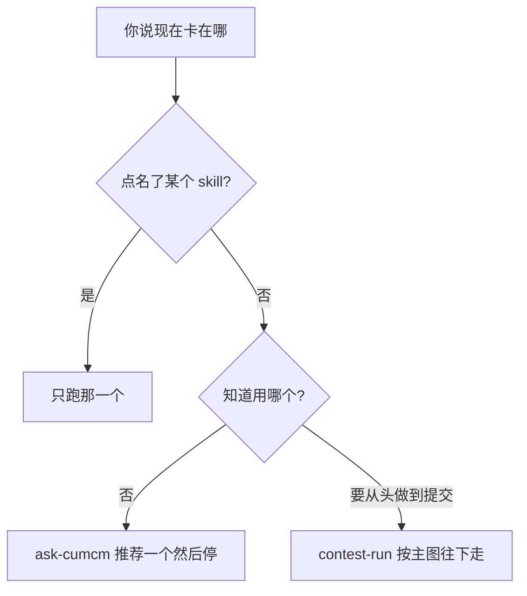
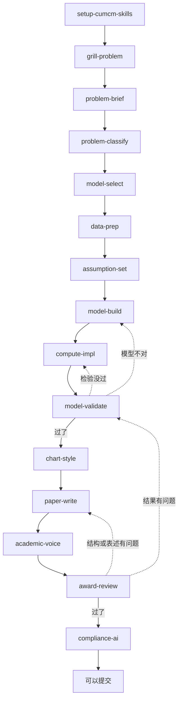
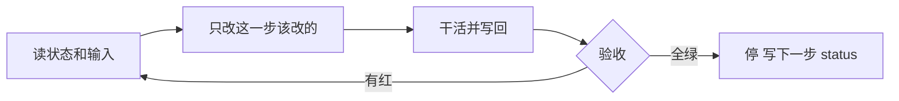
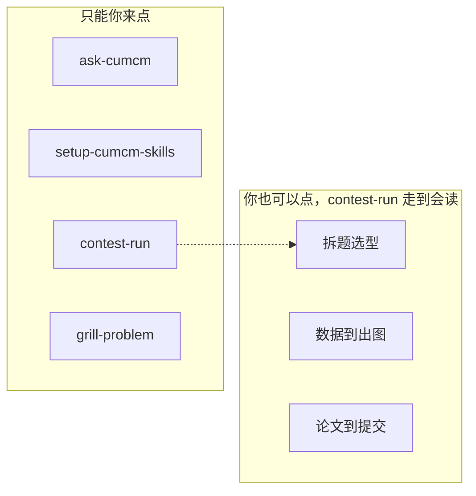

# CUMCM Skills

这是全国大学生数学建模竞赛（CUMCM）的一套 skills 文件，安装到你的 Agent 后，你告诉它现在卡在哪一步，它会按对应技能做完那一步。

适用 Agent 包括 Claude Code、Codex、Cursor、TRAE、OpenClaw、Hermes、DeepSeek Harness、Workbuddy，以及其它按 [agentskills.io](https://agentskills.io/specification) 读技能的 Agent。

竞赛规则只遵守 [www.mcm.edu.cn](https://www.mcm.edu.cn/)。英文站点是 [en.mcm.edu.cn](https://en.mcm.edu.cn/)。CUMCM 是 Contemporary Undergraduate Mathematical Contest in Modeling，不是 COMAP 的 MCM。

更多备赛资料：https://pan.quark.cn/s/daa062665609

## 安装

```bash
npx skills add NemoArce2007/cumcm-skills
```

交互里把 `setup-cumcm-skills` 勾上。各 Agent 把文件放哪，见 [docs/INSTALL.md](docs/INSTALL.md)。

装完后请切换到**赛题目录**再说「运行 setup-cumcm-skills」。这个仓库是 skills 源，不是你交论文的 workspace。

## 怎么用

第一次用，先初始化。题没读懂的情况下先追问。如果已经有数字，只想改摘要，就直接开写论文的技能。不要为了「一次做完」把 17 个技能全读一遍。

不知道该开哪个，对 Agent 说 `ask-cumcm`。它只会推荐一个，然后停。

| 你在干什么 | 开这个 |
| --- | --- |
| 不确定下一步 | `ask-cumcm` |
| 赛题目录还是空的 | `setup-cumcm-skills` |
| 从读题做到提交包 | `contest-run` |
| 题意对不上、附件找不到 | `grill-problem` |
| 拆小问、定题型、选模型 | `problem-brief` → `problem-classify` → `model-select` |
| 数据、假设、公式、代码 | `data-prep` → `assumption-set` → `model-build` → `compute-impl` |
| 误差、灵敏度、稳健性，然后出图 | `model-validate` → `chart-style` |
| 写正文或摘要 | `paper-write` |
| 删套话、把数字补回段落 | `academic-voice` |
| 按评委标准过一遍 | `award-review` |
| AI 声明、支撑材料清单 | `compliance-ai` |

对于谁先谁后的顺序问题，条件写在 [docs/GRAPH.md](docs/GRAPH.md)。某个 skill 怎样才算跑完，看它自己的「验收」一节；共同停机规则在 [docs/LOOP.md](docs/LOOP.md)。

四个只能由你点名的技能：`ask-cumcm`、`setup-cumcm-skills`、`contest-run`、`grill-problem`。其余的你也可以点；Agent 在对的阶段会自己去读。它们之间不要互相调用用户技能。

## 它怎么工作

你开口之后，Agent 只走三条路里的一条：已经点名就只跑那一个；说不清就推荐一个然后停；要从头交卷就按主图往下走。



`contest-run` 的主图如下。实线是往下走，虚线是验收没过、退回去改。



每个 skill 内部都是同一套停法：先读 `contest-state.json`，干完对照自己的验收清单。全绿才改 `status`；有红就只修红项，状态不往前推。



技能分两摊。左边四个只能你来点；右边那些你也可以点，`contest-run` 走到那一截时会自己去读。



## 2026 年必须守的规定

下面这些已经写进验收项，当内容和组委会冲突时，组委会优先级更高。

- 电子版第一页必须是摘要页。摘要含标题和关键词，原则上不超过一页。不要求英文摘要。
- 正文不要目录，不超过 30 页。附录页数不限。
- 附录放可运行源程序，或者写明没有使用程序。
- 全文匿名，不要出现学校、姓名、队号。
- 用了 AI 必须在参考文献前声明，并在支撑材料里交 `AI工具使用详情.pdf`。
- 核心建模由参赛队完成并核验。不要编数据、编文献、编没跑过的结果。

「摘要写 800–1000 字」「正文至少 25 页」常见于培训材料，[2026 年论文格式规范](https://www.mcm.edu.cn/html_cn/node/4cd596519c9eb9fbd866398f6df0caa3.html)里没有这两条。

论文空白模板在 `skills/paper-write/assets/`。LaTeX 是电子版骨架：首页摘要，没有承诺书、编号页和目录。Word 是一份可往里填的大纲。你手头若有带 `\tableofcontents` 的模板，电子版把目录那页删掉。

对于 72 小时怎么规划，见 `skills/contest-run/references/schedule.md`。大体原则是：当晚定方向，次日出结果，第三天成文，截止日检查提交。日期以当年通知为准。

## 仓库里有什么

```
skills/        一个目录一个技能
docs/          编排、停机、状态、安装
templates/     contest-state.json 的字段说明
CONTEXT.md     人和 Agent 共用的词
AGENTS.md      Agent 入门
```

改技能前先读 AGENTS.md。`npm run validate` 会检查 frontmatter 和必备章节。

## 许可证

MIT。无第三方培训讲义，也无未公开赛题。竞赛期间不要把赛题提交到公开仓库。
