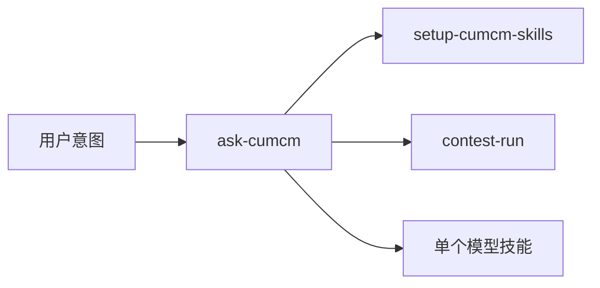

# CUMCM Skills

全国大学生数学建模竞赛（**CUMCM**，Contemporary Undergraduate Mathematical Contest in Modeling）的 Agent Skills。给人看怎么调用，给 Agent 看何时调用、如何验收、下一跳去哪。

思路接近 [mattpocock/skills](https://github.com/mattpocock/skills)：技能小、可组合；**用户技能负责编排，模型技能负责纪律**。全流程用 **graph**（[docs/GRAPH.md](docs/GRAPH.md)），每个节点内部用 **loop**（[docs/LOOP.md](docs/LOOP.md)）。

官方站点：[www.mcm.edu.cn](https://www.mcm.edu.cn/) · [en.mcm.edu.cn](https://en.mcm.edu.cn/)

## 30 秒安装

```bash
npx skills add NemoArce2007/cumcm-skills
```

然后在赛题目录里对 Agent 说：`运行 setup-cumcm-skills`。详细路径见 [docs/INSTALL.md](docs/INSTALL.md)。兼容 Claude Code、Codex、Cursor、TRAE、OpenClaw、Hermes、DeepSeek Harness、Workbuddy 以及其它读 `SKILL.md` 的客户端。

## 何时用哪个技能



| 场景 | 技能 |
| --- | --- |
| 不知道用哪个 | `ask-cumcm` |
| 初始化赛题仓库 | `setup-cumcm-skills` |
| 三天全流程 | `contest-run` |
| 把题问清楚 | `grill-problem` |
| 拆题 / 题型 / 选型 | `problem-brief` → `problem-classify` → `model-select` |
| 数据 / 假设 / 建模 / 代码 | `data-prep` → `assumption-set` → `model-build` → `compute-impl` |
| 三大检验 / 出图 | `model-validate` → `chart-style` |
| 写论文 / 去套话 | `paper-write` → `academic-voice` |
| 评委验收 / AI 声明 | `award-review` → `compliance-ai` |

完整边条件在 GRAPH.md，禁止凭感觉跳步。

## 官方硬约束（技能已写成验收项）

- 摘要专用页原则上不超过一页；电子版第一页必须是摘要页  
- 正文不要目录，不超过 30 页  
- 附录含可运行源程序（或声明未使用程序）  
- 全文匿名  
- 使用 AI 须声明，并在支撑材料提供 `AI工具使用详情.pdf`  
- 核心建模须人工核验；禁止编造数据与文献  

讲义里的“摘要 800–1000 字”“正文至少 25 页”等 **不是** 2026 组委会硬性条文。

## 仓库结构

```
skills/                 # 每个子目录一个 skill
docs/                   # GRAPH / LOOP / STATE / INSTALL
templates/              # contest-state schema
scripts/validate-skills.mjs
CONTEXT.md              # 共用语言
AGENTS.md               # Agent 入门
```

## 原则

1. **Verifier 优先**：没有可观察验收条件的步骤，不算完成。  
2. **最小改动**：单点任务只开一个模型技能。  
3. **证据在前**：论文段落必须能指到表、图、公式或代码输出。  
4. **合规分开**：`academic-voice` 管表达；`compliance-ai` 管声明。二者都不等于“把 AI 检测刷到 0”。

## 许可证

MIT。本仓库不含第三方培训讲义或国赛未公开赛题。
