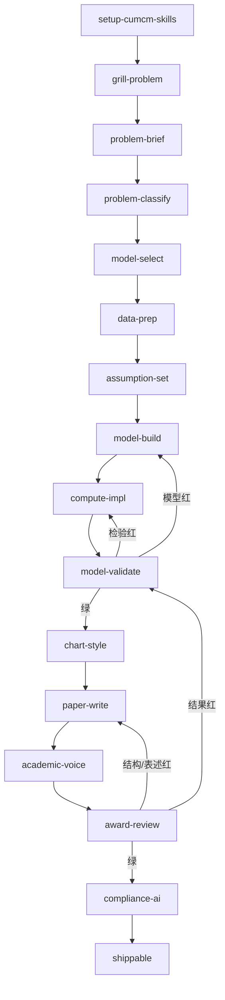

# GRAPH.md — 技能怎么串

Graph engineering：节点做活，边决定下一跳，状态沿边流动。单节点自环就是 loop；国赛全流程必须是图，因为读题、求解、写作、合规不是同一种 verifier。

## 何时用图，何时只用 loop

| 用户意图 | 走法 |
| --- | --- |
| 只改一张图 / 只查摘要 / 只跑灵敏度 | 单节点 loop，不要启动 `contest-run` |
| 从赛题做到可提交 | `contest-run` 图 |
| 已有初稿要诊断 | `award-review` → 按红项回跳对应节点 |
| 不知道用哪个技能 | `ask-cumcm`（路由器，不是建模节点） |

## 节点

| 节点 | skill | 调用方式 | 单一职责 |
| --- | --- | --- | --- |
| R0 | `setup-cumcm-skills` | 仅用户 | 建赛题工作区与 `contest-state.json` |
| R1 | `ask-cumcm` | 仅用户 | 根据意图点名下一个 skill，自己不建模 |
| G0 | `grill-problem` | 仅用户 | 问到赛题理解无歧义 |
| N1 | `problem-brief` | 模型可调用 | 拆小问、约束、陷阱 |
| N2 | `problem-classify` | 模型可调用 | 给每个小问题型 id |
| N3 | `model-select` | 模型可调用 | baseline / primary / 对照 |
| N4 | `data-prep` | 模型可调用 | 读取、质检、预处理，不改题意数据 |
| N5 | `assumption-set` | 模型可调用 | 3–6 条可辩护假设 + 符号表 |
| N6 | `model-build` | 模型可调用 | 公式、推导、与题意对齐 |
| N7 | `compute-impl` | 模型可调用 | 可运行代码与数值结果 |
| N8 | `model-validate` | 模型可调用 | 三大检验 |
| N9 | `chart-style` | 模型可调用 | 美化已有图，不改数据 |
| N10 | `paper-write` | 模型可调用 | 按问题驱动结构写/改论文 |
| N11 | `academic-voice` | 模型可调用 | 去套话、补证据，不改技术含义 |
| N12 | `award-review` | 模型可调用 | 评委视角验收 |
| N13 | `compliance-ai` | 模型可调用 | 声明 + 详情 PDF 清单 |

用户调用的 skill **禁止**再调用另一个用户调用 skill。可以调用模型技能。

## 主图（从零到提交）

并行：不同小问的 N6–N8 可以 fan-out，fan-in 到 N8 总检验或 N10。共享状态里的 `symbols` 与 `assumptions` 在 fan-out 前锁定。

## 边条件（无歧义）

| 从 | 到 | 条件（必须同时满足） |
| --- | --- | --- |
| grill → brief | `contest-state.json` 存在；用户确认题号；赛题原文在 `problem/` |
| brief → classify | 每个小问有 goal / inputs / outputs / constraints |
| classify → select | 每个小问有且仅有一个题型 id（hybrid 必须带拆解） |
| select → data | 每问有 baseline 与 primary；有 why_not |
| data → assume | 原始数据未被覆盖；有质量报告；无题外编造数据 |
| assume → build | 假设 3–6 条且每条有依据；符号无冲突 |
| build → code | 每问有编号公式；模型与题型匹配 |
| code → valid | 入口脚本跑通；论文将引用的数字全部来自输出文件 |
| valid → chart | 三大检验都有量化结果 |
| valid → code | 误差/求解失败 |
| valid → build | 模型与题意不匹配或假设被检验推翻 |
| chart → paper | 图不改数据；有题注 |
| paper → voice | 电子版首页是摘要；无目录；正文≤30 页规划 |
| voice → review | 无空泛段落后仍缺证据的段落清单为 0，或已标记人工待补 |
| review → paper | 仅表述/结构红 |
| review → valid | 结果/检验红 |
| review → comp | 无致命项 |
| comp → shippable | 声明已写；若用了 AI 则详情 PDF 草稿齐 |

## 共享状态

路径：赛题工作区根目录 `contest-state.json`。字段见 [STATE.md](STATE.md) 与 `templates/contest-state.json`。

规则：

1. 进入节点先读状态。
2. 只写本节点「输出」列出的字段。
3. 不得删除其他节点的字段。
4. `status` 只能沿主图前移，或按失败边回退到指定节点对应的 status，禁止跳跃（例如不得从 `classified` 直接标 `paper_drafted`）。

## 路由器

`ask-cumcm` 只输出：推荐 skill 名、原因、不要用哪些 skill。然后停。
